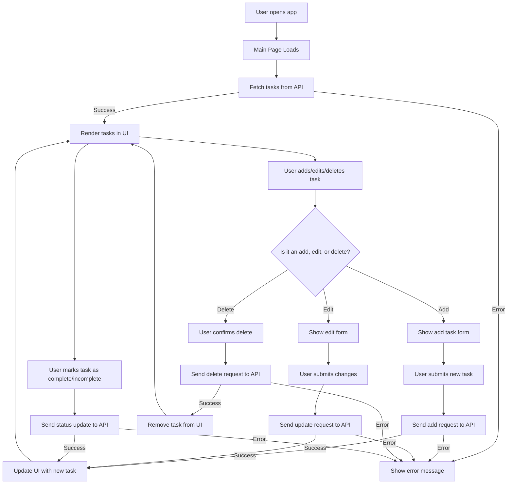

# To-Do App

A modern, full-stack To-Do application built with [Next.js](https://nextjs.org). This project demonstrates best practices in React, API routing, and modular code organization. It provides a simple yet extensible foundation for managing tasks, with a focus on maintainability and scalability.

---

## 🚀 Project Overview

This To-Do App allows users to:

- Add, edit, and delete tasks
- Mark tasks as completed or pending
- View all tasks in a clean, responsive UI

The project is structured for easy extension (e.g., adding authentication, database, or advanced features).

---

## 📁 Folder Structure

<details>
<summary>Project Tree</summary>

```plaintext
to-do-app/
├── app/                  # Next.js app directory (pages, layouts, components)
│   ├── page.js           # Main page component
│   └── ...               # Other UI components and routes
├── public/               # Static assets (images, favicon, etc.)
├── styles/               # Global and modular CSS
├── node_modules/         # Project dependencies
├── .next/                # Next.js build output (auto-generated)
├── package.json          # Project metadata and scripts
├── README.md             # Project documentation
└── ...                   # Config files (jsconfig.json, .gitignore, etc.)
```

</details>

**Key Folders:**

- `app/`: Main application logic, UI components, and routing.
- `public/`: Static files served at the root.
- `styles/`: CSS modules and global styles.
- `.next/`: Build artifacts (do not edit).

---

## 🛠️ Technologies Used

- **Frontend:** Next.js (React), CSS Modules
- **Backend:** Next.js API routes (if present)
- **Build Tool:** Vercel/Next.js built-in tooling
- **Other:** ESLint, Prettier (optional), npm/yarn/pnpm

---

## ⚙️ Setup Instructions

1. **Clone the repository:**

   ```bash
   git clone https://github.com/your-username/to-do-app.git
   cd to-do-app
   ```

2. **Install dependencies:**

   ```bash
   npm install
   # or
   yarn install
   # or
   pnpm install
   ```

3. **Run the development server:**

   ```bash
   npm run dev
   # or
   yarn dev
   # or
   pnpm dev
   ```

4. **Open your browser:**
   Visit [http://localhost:3000](http://localhost:3000)

---

## 📜 Scripts & Commands

| Command  | Description                  |
| -------- | ---------------------------- |
| `dev`    | Start development server     |
| `build`  | Build for production         |
| `start`  | Start production server      |
| `lint`   | Run ESLint (if configured)   |
| `format` | Run Prettier (if configured) |

Example:

```bash
npm run build
npm start
```

---

## 🔄 Application Flow



---

## 💡 Usage Examples

### Add a Task

- Click "Add Task", enter task details, and submit.
- Task appears in the list.

### Mark as Complete

- Click checkbox next to a task to mark as done.

### Delete a Task

- Click the delete icon/button next to a task.

---

## 🤝 Contributing Guide

1. Fork the repository
2. Create a new branch (`git checkout -b feature/your-feature`)
3. Commit your changes (`git commit -am 'Add new feature'`)
4. Push to the branch (`git push origin feature/your-feature`)
5. Open a Pull Request

**Please follow the code style and include tests if possible.**

---

## 🙏 Acknowledgments

- [Next.js Documentation](https://nextjs.org/docs)
- [Vercel](https://vercel.com/)
- [React](https://react.dev/)
- Any open-source libraries used in this project

---

## 📄 License

This project is licensed under the [ISC License](LICENSE).

---
