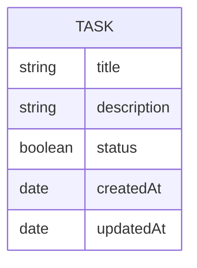

# To-Do App

## Overview
This project is a simple to-do application built using Node.js, Next.js, and MongoDB with Mongoose. It allows users to create, read, update, and delete tasks. The backend API handles CRUD operations for tasks.

## Data Flow Diagram
```mermaid
flowchart TD
    A[Browser Client] --> B[Next.js API Server]
    B --> C[Authentication & Validation Middleware]
    C --> D[Database Connection (connectDb)]
    D --> E[MongoDB Database]
    E --> F[Task CRUD Operations]
    F --> D
    D --> B
    B --> G[API Response]
```

## Database Modeling
The database uses MongoDB with Mongoose ODM. The task schema is defined as follows:

- **title**: A required string representing the task title.
- **description**: A required string providing task details.
- **status**: A boolean indicating if the task is complete (default is false).
- **timestamps**: Automatically tracks creation and update times.

## Entity-Relational Diagram

```mermaid
erDiagram
    TASK {
        string title
        string description
        boolean status
        date createdAt
        date updatedAt
    }
```

## API Endpoints
- **GET /api/tasks**: Retrieves all tasks.
- **POST /api/tasks**: Creates a new task.
- **PUT /api/tasks**: Updates a task's status to true.
- **DELETE /api/tasks**: Deletes a task by document ID.

## Project Structure
- **/lib/models**: Contains Mongoose models.
- **/lib/config**: Handles database connections.
- **/app/api/tasks**: API routes that interact with the database.
- **/README.md**: Project documentation.

## Contribution Guidelines
When contributing, please follow these guidelines:
- Fork the repository and create a feature branch.
- Adhere to the existing project structure and coding style.
- Write clear and descriptive commit messages.
- Test your changes and ensure existing tests pass.
- Submit a pull request with a detailed description of your changes.

## Setup
1. Clone the repository.
2. Run `npm install` to install dependencies.
3. Set the `DATABASE_URL` environment variable with your MongoDB connection string.
4. Run the development server with `npm run dev`.

## Data Flow Summary
- Client requests are received by Next.js API routes.
- API routes initialize a connection with MongoDB using the `connectDb` utility.
- CRUD operations are performed on the tasks collection using Mongoose models.
- Responses are sent back to the client after database operations.

## License
This project is open source.
