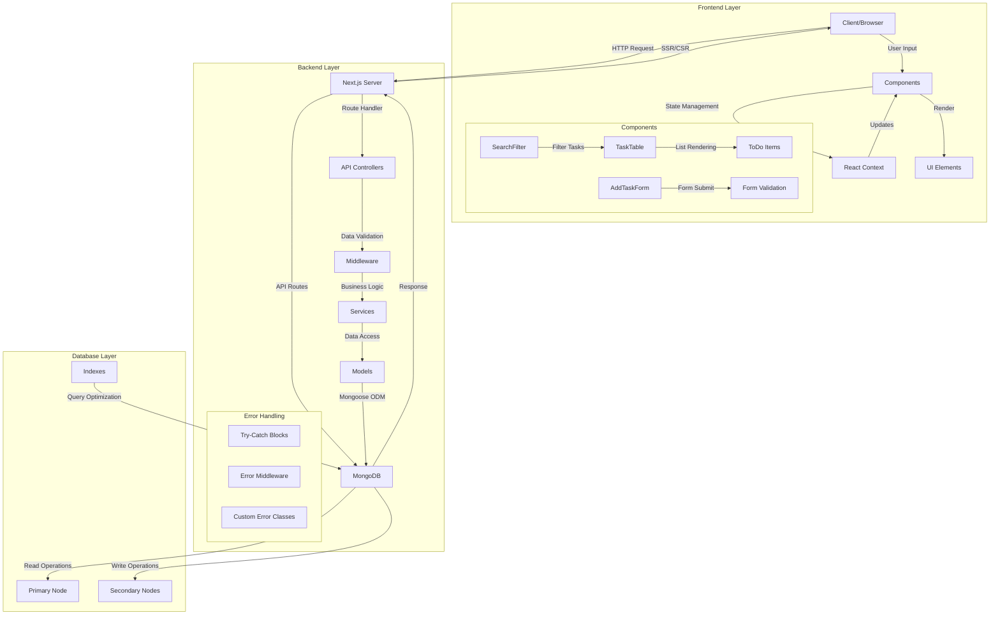
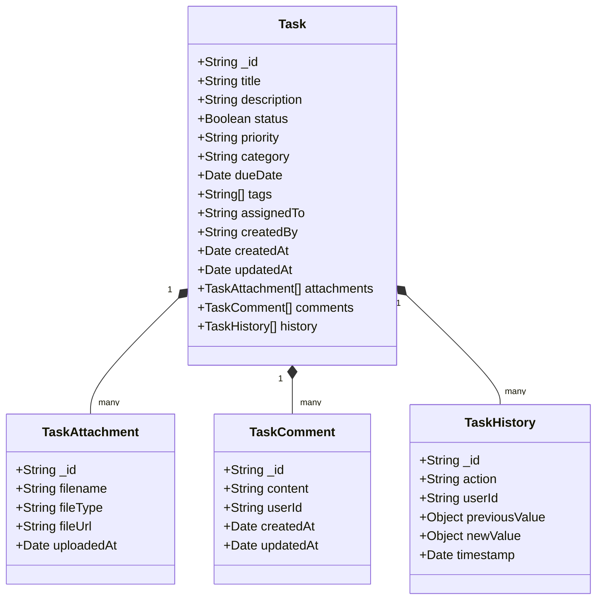
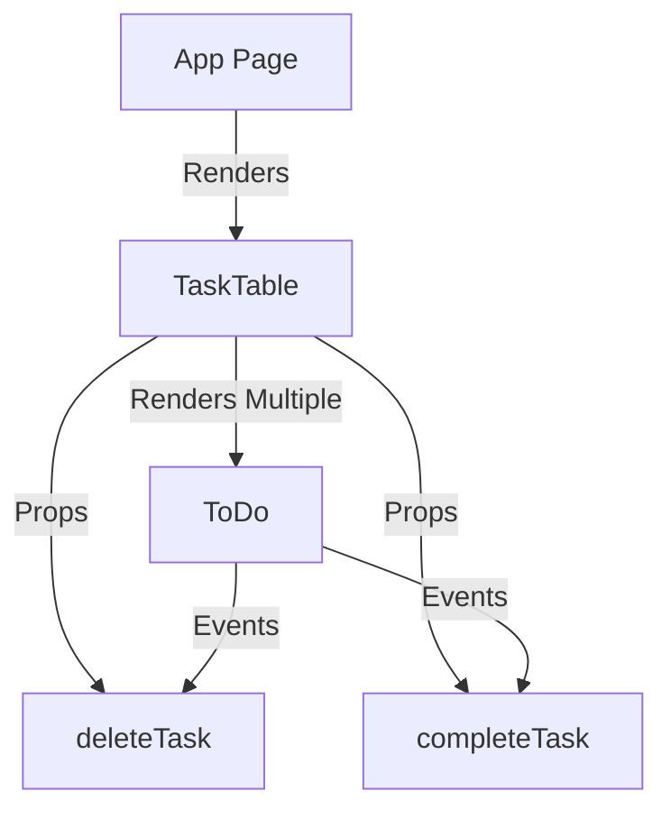

# Next.js To-Do Application

A full-stack to-do list application built with Next.js 15, MongoDB, and Tailwind CSS.

## Table of Contents

- [Overview](#overview)
- [System Architecture](#system-architecture)
- [Database Design](#database-design)
- [Features](#features)
- [Setup Instructions](#setup-instructions)
- [API Documentation](#api-documentation)

## Overview

This application provides a modern, responsive interface for managing tasks with real-time updates and persistent storage using MongoDB.

## System Architecture

### Detailed Data Flow Diagram


```mermaid
graph TD
    A[Client/Browser] -->|HTTP Request| B[Next.js Server]
    B -->|API Routes| C[MongoDB]
    C -->|Response| B
    B -->|SSR/CSR| A

    subgraph "Frontend Layer"
        A -->|User Input| D[Components]
        D -->|State Management| E[React Context]
        E -->|Updates| D
        D -->|Render| F[UI Elements]

        subgraph "Components"
            G[TaskTable] -->|List Rendering| H[ToDo Items]
            I[AddTaskForm] -->|Form Submit| J[Form Validation]
            K[SearchFilter] -->|Filter Tasks| G
        end
    end

    subgraph "Backend Layer"
        B -->|Route Handler| L[API Controllers]
        L -->|Data Validation| M[Middleware]
        M -->|Business Logic| N[Services]
        N -->|Data Access| O[Models]
        O -->|Mongoose ODM| C

        subgraph "Error Handling"
            P[Try-Catch Blocks]
            Q[Error Middleware]
            R[Custom Error Classes]
        end
    end

    subgraph "Database Layer"
        C -->|Read Operations| S[Primary Node]
        C -->|Write Operations| T[Secondary Nodes]
        U[Indexes] -->|Query Optimization| C
    end
```

## Enhanced Database Design

### Comprehensive Task Schema


```mermaid
classDiagram
    class Task {
        +String _id
        +String title
        +String description
        +Boolean status
        +String priority
        +String category
        +Date dueDate
        +String[] tags
        +String assignedTo
        +String createdBy
        +Date createdAt
        +Date updatedAt
        +TaskAttachment[] attachments
        +TaskComment[] comments
        +TaskHistory[] history
    }

    class TaskAttachment {
        +String _id
        +String filename
        +String fileType
        +String fileUrl
        +Date uploadedAt
    }

    class TaskComment {
        +String _id
        +String content
        +String userId
        +Date createdAt
        +Date updatedAt
    }

    class TaskHistory {
        +String _id
        +String action
        +String userId
        +Object previousValue
        +Object newValue
        +Date timestamp
    }

    Task "1" *-- "many" TaskAttachment
    Task "1" *-- "many" TaskComment
    Task "1" *-- "many" TaskHistory
```

### Data Models Specification

#### Task Model

| Field       | Type     | Required | Default   | Description              |
| ----------- | -------- | -------- | --------- | ------------------------ |
| title       | String   | Yes      | -         | Task title (3-100 chars) |
| description | String   | Yes      | -         | Detailed description     |
| status      | Boolean  | No       | false     | Completion status        |
| priority    | String   | No       | 'medium'  | low/medium/high          |
| category    | String   | No       | 'general' | Task category            |
| dueDate     | Date     | No       | null      | Task deadline            |
| tags        | [String] | No       | []        | Array of tags            |
| assignedTo  | String   | No       | null      | User ID of assignee      |
| createdBy   | String   | Yes      | -         | User ID of creator       |
| attachments | [Object] | No       | []        | File attachments         |
| comments    | [Object] | No       | []        | Task comments            |
| history     | [Object] | No       | []        | Change history           |

#### Indexes

```javascript
{
  title: 'text',
  description: 'text',
  status: 1,
  dueDate: 1,
  category: 1,
  priority: 1
}
```

## Features

- Create new tasks with title and description
- Mark tasks as completed
- Delete tasks
- Real-time updates using Next.js App Router
- Persistent storage with MongoDB
- Responsive design with Tailwind CSS

## Setup Instructions

1. Clone the repository

```bash
git clone <repository-url>
```

2. Install dependencies

```bash
npm install
```

3. Set up environment variables
   Create a `.env.local` file with:

```
DATABASE_URL=your_mongodb_connection_string
```

4. Run the development server

```bash
npm run dev
```

## API Documentation

### Enhanced Endpoints

#### GET /api/tasks

```typescript
interface QueryParams {
  page?: number;
  limit?: number;
  status?: boolean;
  category?: string;
  priority?: string;
  search?: string;
  startDate?: Date;
  endDate?: Date;
}

interface Response {
  tasks: Task[];
  totalCount: number;
  currentPage: number;
  totalPages: number;
}
```

#### POST /api/tasks

- Creates a new task
- Body: `{ title: string, description: string }`
- Response: `{ msg: string }`

#### DELETE /api/tasks

- Deletes a task
- Body: `{ documentId: string }`
- Response: `{ msg: string }`

#### PUT /api/tasks

- Updates task status
- Body: `{ documentId: string }`
- Response: `{ msg: string }`

## Component Structure


```mermaid
graph TD
    A[App Page] -->|Renders| B[TaskTable]
    B -->|Renders Multiple| C[ToDo]
    B -->|Props| D[deleteTask]
    B -->|Props| E[completeTask]
    C -->|Events| D
    C -->|Events| E
```

## Data Model

### Task Model Properties

| Field       | Type      | Required | Default |
| ----------- | --------- | -------- | ------- |
| title       | String    | Yes      | -       |
| description | String    | Yes      | -       |
| status      | Boolean   | No       | false   |
| createdAt   | Timestamp | Auto     | Now     |
| updatedAt   | Timestamp | Auto     | Now     |

## Technologies Used

- Next.js 14
- MongoDB with Mongoose
- Tailwind CSS
- React
- Node.js

## Best Practices

- RESTful API design
- Component-based architecture
- Responsive design principles
- Error handling
- TypeSafe database operations

## Error Handling

The application implements comprehensive error handling:

- Database connection errors
- API request/response errors
- Frontend validation
- Mongoose schema validation

## Future Enhancements

- [ ] User authentication
- [ ] Task categories
- [ ] Due dates
- [ ] Priority levels
- [ ] Search functionality
- [ ] Task filters

## Performance Optimizations

- MongoDB indexes for frequent queries
- Server-side pagination
- React memo for expensive components
- Image optimization
- API response caching
- Debounced search
- Lazy loading of components

## Security Measures

- Input sanitization
- JWT authentication
- Rate limiting
- CORS configuration
- HTTP-only cookies
- XSS protection
- CSRF tokens
- Environment variable protection

## Monitoring

- Error logging
- Performance metrics
- User analytics
- API usage tracking
- Database monitoring

## Contributing

Contributions are welcome! Please read the contributing guidelines before submitting PRs.

## License

MIT License
