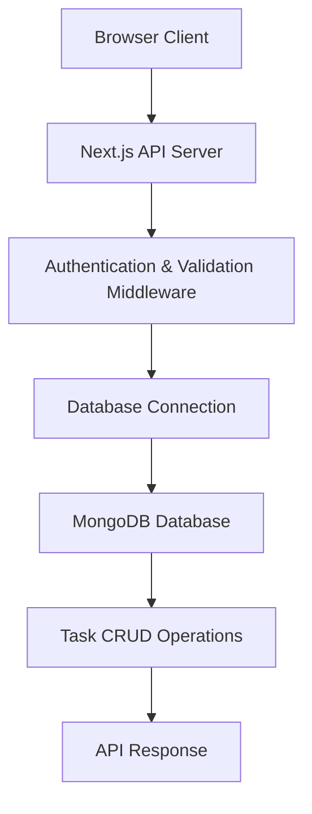
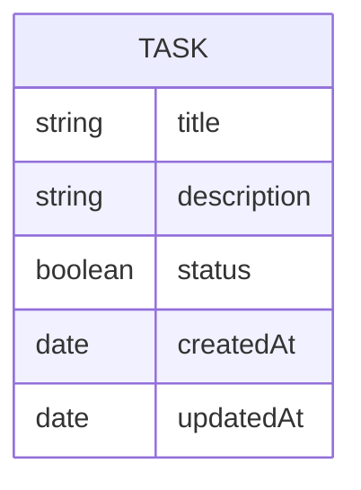

# To-Do App

## Overview

This project is a robust to-do application built using Node.js, Next.js, and MongoDB with Mongoose. It supports complete CRUD (Create, Read, Update, Delete) operations on tasks. The application is designed to be scalable and maintainable, featuring a clean API and well-structured modular code.

## Features

- Create, read, update, and delete tasks.
- Real-time API endpoints using Next.js.
- MongoDB for data persistence with Mongoose ODM.
- Clear and modular project structure.

## Setup

1. Clone the repository.
2. Run `npm install` to install all dependencies.
3. Set the `DATABASE_URL` environment variable with your MongoDB connection string.
4. Start the development server with `npm run dev`.

## API Endpoints

- **GET /api/tasks**: Retrieves all tasks.
- **POST /api/tasks**: Creates a new task.
- **PUT /api/tasks**: Updates the status of a specific task to complete.
- **DELETE /api/tasks**: Deletes a task using the document ID.

## Project Structure

- **/lib/models**: Contains Mongoose models.
- **/lib/config**: Handles database connection logic.
- **/app/api/tasks**: Next.js API routes that perform CRUD operations.
- **/README.md**: Project documentation.

## Diagrams

### Data Flow Diagram

```mermaid
flowchart TD
    A[Browser Client] --> B[Next.js API Server]
    B --> C[Authentication & Validation Middleware]
    C --> D[Database Connection]
    D --> E[MongoDB Database]
    E --> F[Task CRUD Operations]
    F --> G[API Response]
```

### Entity-Relationship Diagram

```mermaid
erDiagram
    TASK {
        string title
        string description
        boolean status
        date createdAt
        date updatedAt
    }
```

## Contribution Guidelines

- Fork the repository and create a feature branch.
- Adhere to the existing project structure and coding style.
- Write clear commit messages.
- Test your changes thoroughly and ensure all existing tests pass.
- Create a pull request with a detailed description of your changes.

## Additional Information

- The project leverages modern JavaScript features and ESLint for code quality.
- For any queries, please refer to the issues section or contact the maintainer.
